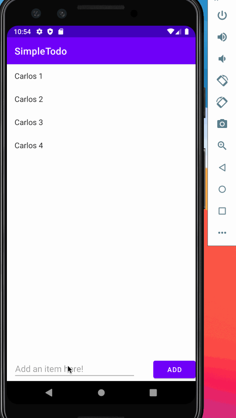

# Project 1 - Simple todoo

SimpleTodo is an android app that allows building a todo list and basic todo items management functionality including adding new items, editing and deleting an existing item.

Submitted by: **Carlos Estrada Ceballos**

Time spent: **5** hours spent in total

## User Stories

The following **required** functionality is completed:

* [x] User can **view a list of todo items**
* [x] User can **successfully add and remove items** from the todo list
* [x] User's **list of items are persisted** across app restarts

The following **bonus** features are implemented:

* [x] User can **tap a todo item in the list and bring up an edit screen for the todo item** and then have any changes to the text reflected back in the todo list

The following **additional** features are implemented:

* [x] List anything else that you can get done to improve the app functionality!

## Video Walkthrough

Here's a walkthrough of implemented user stories:

GIF created with [LICEcap](https://www.cockos.com/licecap/).

## Notes

The first thing I found was that we can add an empty note, for this I made a conditional that would verify if there was something written, otherwise not to add the note and showing a message of what happened

The second thing was that in the tutorial it said how to edit a note by creating a new activity, this seemed badly thought out for the user experience since it is not very comfortable to be jumping in many screens, it becomes a time-consuming process, for this I opted for create a small window while being in the same activity, I added a button that closes the window and saves the changes made, in my opinion it is a more comfortable way to edit the notes

**Points to improve:**
- One point to improve is the layout of the list, I think we can create a better layout to show that it is a to-do list and not just nonsensical sentences, an example could be adding bullets to the list or a checkbox for the tasks that have already been done
- We can create checkbox for the tasks that have already been done

## License

    Copyright [2021] [Facebook]

    Licensed under the Apache License, Version 2.0 (the "License");
    you may not use this file except in compliance with the License.
    You may obtain a copy of the License at

        http://www.apache.org/licenses/LICENSE-2.0

    Unless required by applicable law or agreed to in writing, software
    distributed under the License is distributed on an "AS IS" BASIS,
    WITHOUT WARRANTIES OR CONDITIONS OF ANY KIND, either express or implied.
    See the License for the specific language governing permissions and
    limitations under the License.
